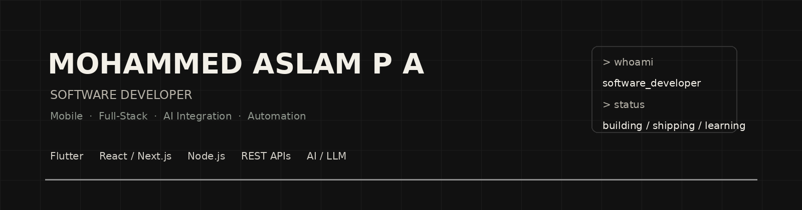
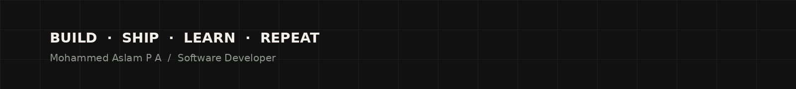

<div align="center">
  
</div>

<br/>

<div align="center">

**Software Developer building mobile apps, full-stack products, and practical AI integrations.**

[LinkedIn](https://linkedin.com/in/mohaslam) ·
[Portfolio](https://mohammed-aslam-personal-portfolio-w.vercel.app) ·
[Email](mailto:mohaslam861@gmail.com)

</div>

---

## ⌁ whoami

```text
Software Developer.

I build products across mobile, web and AI —
from Flutter applications and REST APIs
to full-stack interfaces and practical LLM workflows.
```

## ⌁ engineering.log

```text
2023  → BSc Computer Science
2023  → Android development internship
2024  → Flutter development internship
2025  → M.Voc Software Application Development
2025  → Software engineering internship
2026  → Full-stack + AI product development
      → Dubai, UAE
```

## ⌁ stack

```text
mobile/       Flutter · Dart · Android · Kotlin
frontend/     React · Next.js · TypeScript · Tailwind CSS
backend/      Node.js · REST APIs · Firebase
data/         MongoDB · SQLite · SQL
ai/           LLM APIs · AI integration · RAG · automation
tools/        Git · GitLab · Postman · Figma · Linux
```

## ⌁ selected_work

<table>
<tr>
<td width="50%" valign="top">

### 🩺 [Medical AI](https://github.com/mohaslam11/medical-ai)

Flutter-based application for analysing user-uploaded
medical PDFs with AI and turning them into structured
health insights, precautions and recommendations.

`Flutter` `AI` `PDF` `Healthcare`

</td>

<td width="50%" valign="top">

### 🍽️ [Platesy](https://github.com/mohaslam11/platesy-food-sharing)

Food-sharing application built around homemade food,
location discovery, seller contact and buyer-seller
interaction.

`Flutter` `GetX` `REST API` `Android`

</td>
</tr>

<tr>
<td width="50%" valign="top">

### 🤖 [Travnook Lead Qualifier](https://github.com/mohaslam11/travnook-lead-qualifier)

AI-assisted lead qualification system that analyses
sales leads with an LLM, assigns a score and exports
results to Google Sheets.

`Python` `Groq` `Automation` `Google Sheets`

</td>

<td width="50%" valign="top">

### 🌐 [Personal Portfolio](https://github.com/mohaslam11/Mohammed-Aslam-personal-portfolio)

Personal developer portfolio built to present projects,
technical work, case studies and the products behind them.

`JavaScript` `React` `Web`

</td>
</tr>
</table>

<div align="center">

**→ More projects and case studies**

[Portfolio](https://mohammed-aslam-personal-portfolio-w.vercel.app)

</div>

---

## ⌁ what I work on

```text
01  Mobile products
    Flutter · Android · state management · API integration

02  Full-stack products
    React / Next.js · Node.js · REST APIs · Firebase

03  AI integrations
    LLM APIs · document workflows · RAG · structured outputs

04  Automation
    workflow automation · browser automation · data processing
```

---

## ⌁ currently

```text
building/     Medical AI
learning/     AI agent workflows · cloud architecture · cybersecurity
open_to/      Full-time software development roles
```

---

## ⌁ contribution_graph

<div align="center">

<!--START_SECTION:snake-->

<!--END_SECTION:snake-->

</div>

---

## ⌁ connect

<div align="center">

[LinkedIn](https://linkedin.com/in/mohaslam) ·
[Portfolio](https://mohammed-aslam-personal-portfolio-w.vercel.app) ·
[GitHub](https://github.com/mohaslam11) ·
[Email](mailto:mohaslam861@gmail.com)

</div>

<br/>

<div align="center">

```text
> status
open to full-time software development roles

> principle
build it → test it → make it useful
```

</div>

<br/>

<div align="center">
  
</div>
